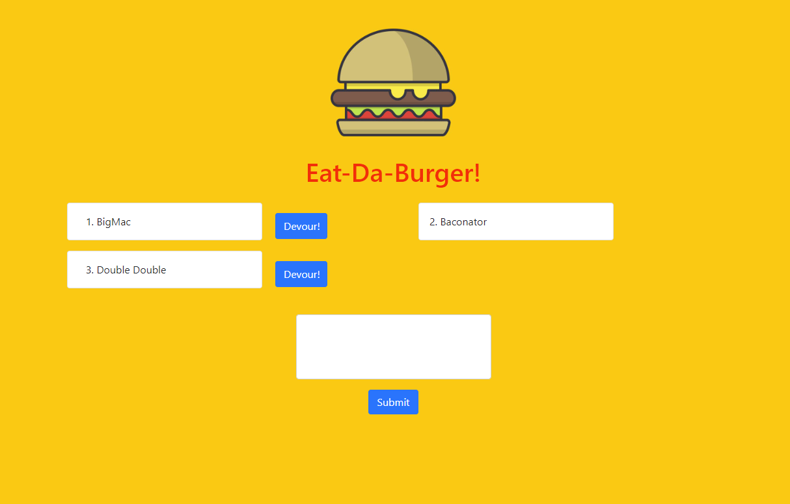

## Eat-Da-Burger!

## Description

Want a double double? Type it in the box and submit! Devour or not to devour is now the question.

Using mysql database and handlebars to load all into body

## Deployed Application

Link to the application: https://glacial-taiga-08008.herokuapp.com/

## Running the tests

There were no automated tests during the process of this application.

## Built with

* [Express-Handlebars](https://www.npmjs.com/package/express-handlebars) - The view engine
* [MySQL](https://www.mysql.com/) - Database used
* [Bootstrap](https://getbootstrap.com/) - Styling toolkit
* ORM - Object relational mapping

## Contributing

There are many ways in which you can participate in the project, for example: 
* Submit bugs and feature requests to the email below, and help us verify as they are checked in 
* Review source code changes
* Review the documentation and make pull requests for anything from typos to new content

## License

This project is licensed under the MIT License

## Questions

For any additional questions see my [GitHub profile](http://github.com/tylerpetri) or contact tylerpetri93@gmail.com
